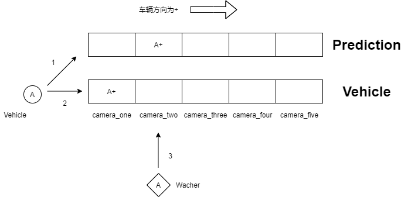
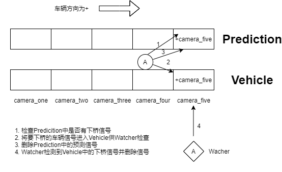

# 危化品车辆检测

## 需求
现有十二台摄像机,摄像机会捕获镜头内的危化品车辆，并向服务端发送警告。十二台摄像机安装在双向车道中间位置，可同时捕捉到两个方向的车辆，任何方向的车辆经过摄像机都会发出警告。发送的警告中没有车辆的任何信息。服务端需要在收到警告信息后判断车辆的行驶状况，根据车辆的行驶情况向MQ中推送该车的行驶状况(速度过慢、停车、倒车)。
### 检测方法设计

#### 上桥检测
1.当端点摄像机捕获到车辆时,检查Prediction队列中是否有该摄像机的反方向预测信号，如果有则取出预测队列中反方向信号的生成时间进行对比如果远小于车辆通过摄像头区间的最小时间则判定为入队。\
2.标记完方向后标记车辆方向将其入队Vehicle队列的camera_one bucket中(端点摄像机)，并在Prediction队列中加入车辆要通过的下一个摄像机ID(Camera_two)作为预测。\
3.启动一个Watcher监视camera_two。在经过车辆最大通过时间后去查询camera_two是否捕获到车辆，如果捕获到车辆则对比预测队列中的方向是否相同，如果相同则删除camera_one bucket中的车辆信息，Watcher结束工作。\
\

#### 下桥检测
1.车辆被camera_five捕获后，查询Prediction队列中是否有对应方向的预测下桥信号如果有则判定为下桥。\
2.在Vehicle中添加信号供Watcher检查，同时删除Prediction中的预测信号。\
3.Watcher检测到Vehicle中有下桥信号时，删除Vehicle中下桥信号结束工作。\
\

